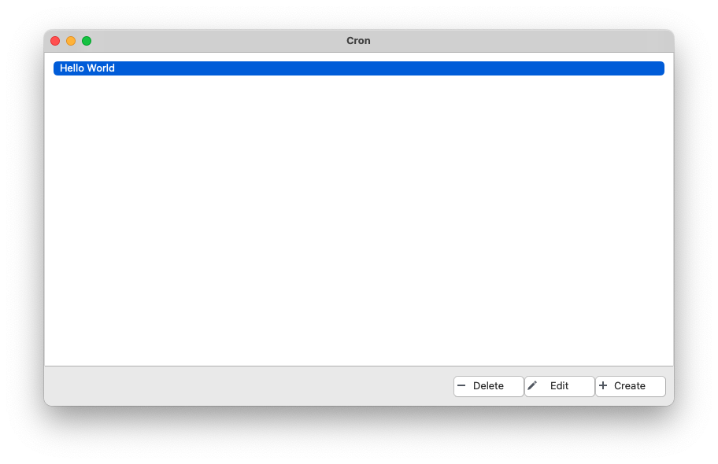
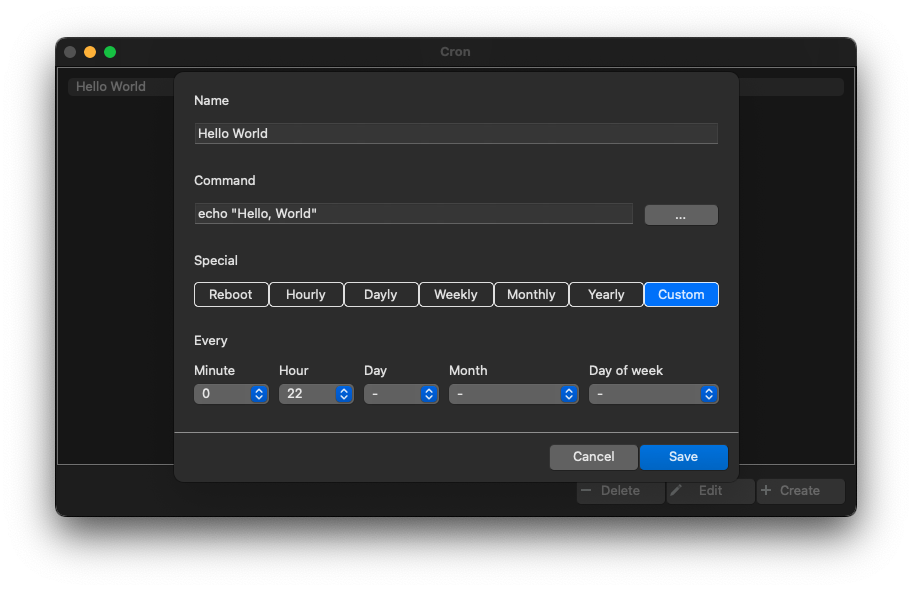

# cron-gui
 
Simple GUI to managing your local crontab on Windows, macOS and linux.

  

⚠️ cron-gui IS UNDER DEVELOPMENT AND IS NOT READY TO BE USED. ⚠️

## Features

* Create task;
* Read task;
* Update task;
* Delete task;

## Screenshots

### Main form

#### macOS 

### Task editor

#### macOS 

